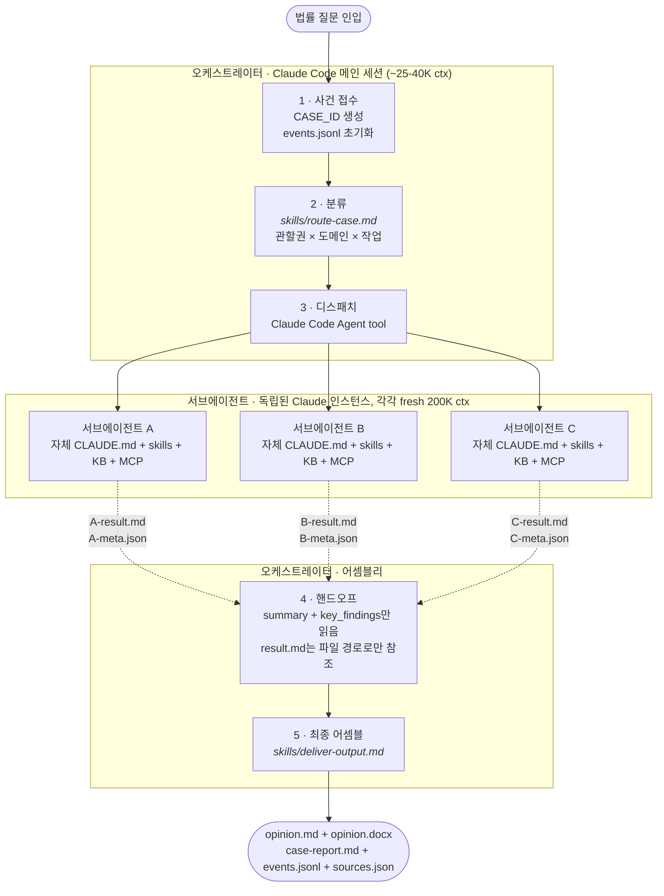
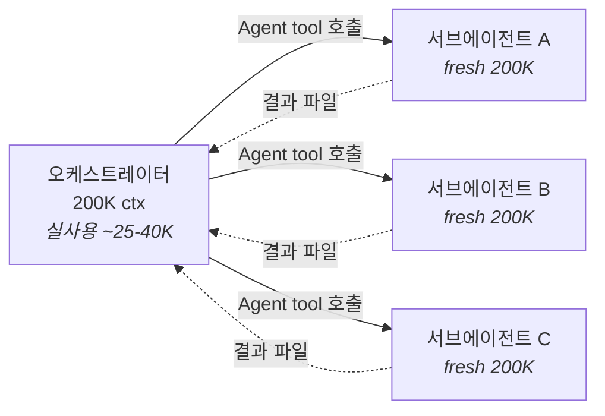

# KP 리걸 오케스트레이터 · KP Legal Orchestrator

**English:** [README.md](README.md)

> Claude Code 위에서 돌아가는 AI 기반 법률 워크플로우 시스템. 8명의 전문 스페셜리스트 에이전트가 협업하여 감사 가능한 법률 분석 결과물을 생성합니다.
>
> 면책 안내: 이 저장소는 법률 리서치, 드래프팅, 리뷰, 워크플로우 오케스트레이션을 지원하기 위한 AI 시스템입니다. 자격 있는 전문가의 법률자문을 대체하는 용도로 사용되어서는 안 되며, AI 산출물에는 오류, 부정확한 인용, 불완전한 분석이 포함될 수 있으므로 실제 의사결정 전에는 별도 검토가 필요합니다. 이 저장소의 사용만으로 변호사-의뢰인 관계가 성립하지 않습니다.


---

## 개요

시중의 "법률 AI"는 대부분 단일 LLM에 질문을 던지는 구조입니다. 이 프로젝트는 다릅니다.

**리드 오케스트레이터가 전체 조율 역할**을 맡습니다. 들어오는 질문을 분류하고, 적합한 전문 스페셜리스트 에이전트에게 배정하고, 협업 패턴(순차 핸드오프 / 병렬 리서치 / 멀티라운드 토론)을 직접 선택합니다. 8명의 하위 에이전트는 각자 다른 관할권, 지식 베이스, MCP 도구를 가진 진짜 Claude Code 에이전트이며, 이 프로젝트는 그들을 **단 한 줄도 수정하지 않고 100% 그대로 재활용**합니다.

모든 단계는 `events.jsonl`에 기록되며, 최종 전달 단계에서 사건 전체가 하나의 `case-report.md`로 다시 묶입니다. 어느 스페셜리스트가 배정됐는지, 어떤 소스(Grade A/B/C)를 인용했는지, 팩트체커가 무엇을 지적했는지, 리비전이 어떻게 해소됐는지 — 전부 한 파일에서 확인할 수 있습니다.

---

## 팀 소개 — KP Legal Orchestrator 에이전트

이 저장소는 가상의 AI 법률 워크플로우 시스템 **KP Legal Orchestrator**의 중앙 오케스트레이터입니다. 아래 8명의 스페셜리스트는 각자 독립된 GitHub 리포지토리에 standalone Claude Code 에이전트로 존재합니다. `./setup.sh`를 실행하면 이들 전부가 `agents/` 아래로 clone되어 바로 디스패치할 수 있는 상태가 됩니다.

| 담당 스페셜리스트 | Agent 리포지토리 | 실제로 하는 일 | Phase |
|------------|------------------|---------------|-------|
| **범용 법률 리서치 스페셜리스트** | [general-legal-research](https://github.com/kipeum86/general-legal-research) | **17+ 관할권**을 커버하는 증거 기반 국제 법률 리서치. 한국법뿐 아니라 어느 관할권의 어떤 법률 질문이든 받는 제너럴리스트 리서치 어소시엇. Grade A 1차 소스 우선 워크플로우. | Phase 1 ✓ |
| **법률문서 작성 스페셜리스트** | [legal-writing-agent](https://github.com/kipeum86/legal-writing-agent) | **한/영 이중 언어** 비계약 법률 문서 드래프터. 신규 작성 D1–D6 파이프라인, 리비전 R1–R7 tracked-change 파이프라인. 한국어 문서는 쟁점→결론→분석 관행, 영어 문서는 IRAC/CRAC + Bluebook/OSCOLA 관행 적용. | Phase 1 ✓ |
| **시니어 리뷰 스페셜리스트** | [second-review-agent](https://github.com/kipeum86/second-review-agent) | AI 생성 법률 문서 최종 품질 게이트. 인용을 **여러 primary legal database**(law.go.kr, congress.gov, eur-lex 등)에 대해 verbatim 대조하고, 법적 논리와 작성 품질을 점검하며, tracked change가 들어간 redlined DOCX를 생성합니다. 독립 release 게이트(Pass / Pass with Warnings / Manual Review Required / Not Recommended). 환각 인용 zero tolerance. | Phase 1 ✓ |
| **개인정보보호법 스페셜리스트** | [PIPA-expert](https://github.com/kipeum86/PIPA-expert) | 한국 개인정보보호법 전문가. 구조화 RAG 기반: **법조문 929건, PIPC 공식 가이드라인 46건, landmark 판례·해석례 30건, cross-reference 엣지 2,369개**. 전문 형식의 DOCX 의견서 산출. | Phase 2 ✓ |
| **GDPR 스페셜리스트** | [GDPR-expert](https://github.com/kipeum86/GDPR-expert) | EU 데이터보호법 전문가. 구조화 RAG 기반: **EU 법률 5개(조문 321 + recital 535), EDPB 문서 120건, CJEU 판결 51건, enforcement 결정 33건** — 인덱스 아이템 1,060+. | Phase 2 ✓ |
| **게임산업 리서치 스페셜리스트** | [game-legal-research](https://github.com/kipeum86/game-legal-research) | 국제 게임 산업 법률 리서치. 게임 클라이언트 자문을 위한 다관할권 규제 비교. 증거 기반, 1차 소스 우선, deliverable 수준 결과물 로컬 출력 파이프라인 보유. | Phase 2 ✓ |
| **계약서 검토 스페셜리스트** | [contract-review-agent](https://github.com/kipeum86/contract-review-agent) | 계약서 검토 파이프라인 — 계약서를 drop하면 **tracked-change redline이 들어간 DOCX, 여백 코멘트(internal strategy + external-facing), 전체 분석 리포트, 협상 권고**가 반환됩니다. Node.js + Python 스택. 최종 법률 판단은 사람이 합니다. | Phase 2 |
| **법률 번역 스페셜리스트** | [legal-translation-agent](https://github.com/kipeum86/legal-translation-agent) | **5개 언어** 법률 문서 번역. zero-omission 보장, dual-pass 번역을 comparative synthesis로 병합. 관할권 인식 용어(BGB, UCC, PRC, Taiwan, APPI) 준수, 매 작업마다 성장하는 shared 번역 메모리. | Phase 2 |

**오케스트레이터는 하위 에이전트의 `CLAUDE.md`, skills, 지식 베이스를 절대 수정하지 않습니다.** 이것이 "100% 재활용"의 실천입니다. 하위 에이전트는 `agents.lock`으로 고정됩니다. 어느 스페셜리스트가 자기 리포에 버그 픽스를 올리면 `./setup.sh update-lock`으로 lock을 의도적으로 갱신하고, 변경된 lockfile을 커밋합니다.

> `setup.sh`는 이 오케스트레이터가 직접 사용하는 리포지토리만 clone합니다. 이 워크플로우 밖의 standalone 프로젝트는 포함되지 않습니다.

---

## 작동 방식

법률 질문 하나를 던지면 오케스트레이터가 라우팅하고, 전문가들이 일하고, 의견서가 나옵니다. 전형적인 처리 흐름은 아래와 같습니다.

| 단계 | 에이전트 | 수행한 작업 | 산출물 |
|------|---------|------------|--------|
| **1. 리서치** | 범용 법률 리서치 스페셜리스트 · `general-legal-research` | 관련 MCP와 1차 법률 데이터베이스에서 법조문, 판례, 규제기관 가이드, 집행 경로를 수집 | `research-result.md` |
| **2. 드래프팅** | 법률문서 작성 스페셜리스트 · `legal-writing-agent` | 정형화된 법률 메모 형식으로 초안을 작성 | `opinion.md` |
| **3. 리뷰** | 시니어 리뷰 스페셜리스트 · `second-review-agent` | 블록 인용구를 verbatim 대조하고, severity 기준으로 코멘트를 반환 | `review-result.md` |
| **4. 리비전 rescue** | `legal-writing-agent` + 오케스트레이터 | 리비전이 막히면 오케스트레이터가 직접 1차 소스를 재대조 | `verbatim-verification.md` |
| **5. 최종 전달** | 오케스트레이터 | 최종 전달 묶음을 조립하고 클라이언트용 파일을 생성 | `opinion.docx`, `case-report.md` |

**결과:** 감사 가능한 소스 묶음, typed event log, 리뷰 결과, 최종 전달 파일이 남습니다.

### 시스템 다이어그램



### 협업 패턴 3종

| 패턴 | 구조 | 언제 사용하나 | 상태 |
|------|------|-------------|------|
| **1 · 병렬 리서치 → 통합** | `[A ∥ B] → writing → review` | 토론까지는 필요 없는 다관할권·다도메인 (예: EU 시장 진출을 위한 GDPR + 국제 게임규제 결합 분석) | ✅ Phase 2.2 검증 |
| **2 · 순차 핸드오프** | `A → writing → review` | 단일 관할권 또는 단일 도메인 (Phase 1 기본) | ✅ Phase 1 E2E 검증 |
| **3 · 멀티라운드 토론** | `A → B 반론 → A 재반론 → writing verdict → review` | 전문가 간 의견 충돌 가능성이 있는 다관할권 질문 | 🚧 Phase 2.3 |

Pattern 3이 킬러 피처입니다. 서로 다른 관할권의 두 전문가가 각자의 지식 베이스를 가진 채 **실제로 논쟁합니다**. 단일 LLM으로는 이를 구현할 수 없습니다 — "서로 다른 외국법 전문가 둘을 동시에 롤플레이"해도 결국 같은 priors에서 나오기 때문입니다. 두 개의 독립 에이전트는 context가 실제로 공유되지 않습니다.

---

## 왜 이 아키텍처인가

멀티에이전트 업계 표준은 LangGraph · CrewAI · AutoGen · Claude Agent SDK 같은 프레임워크를 웹 서버로 감싸는 것입니다. Claude Code 자체를 오케스트레이션 런타임으로 사용하는 것은 비주류입니다. 네 가지 오해부터 풀어야 답이 나옵니다:

### 1. "에이전트 8개를 한 오케스트레이터에 꾸겨 넣으면 성능 저하 아닌가?"

아닙니다. Claude Code `Agent` tool이 어떻게 작동하는지에 대한 오해입니다.

각 서브에이전트는 **완전히 독립된 새 Claude 인스턴스**이며, 200K 컨텍스트 윈도우를 통째로 새로 받습니다. 오케스트레이터는 그 무게를 짊어지지 않고 조율만 합니다.



오케스트레이터가 사용하는 토큰은 질문 분류, 디스패치 프롬프트, 결과 summary 읽기뿐입니다 (총 ~25–40K). 전문가 각각은 자기 CLAUDE.md, 스킬, 지식 베이스, MCP 도구까지 전부 살아 있는 상태로 풀 캐파시티로 동작합니다. **"꾸겨 넣기"의 반대 — 구조적으로 가능한 가장 context-efficient한 멀티에이전트 설계입니다.**

### 2. "왜 LangGraph나 Agent SDK를 안 썼나?"

기존 Claude Code 에이전트를 웹 프레임워크로 감싸면 capability의 40~50%가 소실됩니다: MCP가 끊기고, 스킬 시스템을 재구현해야 하고, KB 탐색 방식이 달라집니다. 결국 원본 에이전트의 절반 수준 퀄리티만 나오는 예쁜 데모가 됩니다.

그래서 트레이드오프를 뒤집었습니다: **Claude Code를 런타임으로 사용하고, 에이전트 capability를 100% 보존하고, 최종 전달은 웹 UI 대신 단일 `case-report.md` 산출물로 수렴시킵니다.** 실제 법률 업무가 돌아가는 아키텍처입니다 — 데모가 아닙니다.

### 3. 프로세스 자체가 프로덕트입니다

상용 법률 AI 제품은 대체로 블랙박스입니다. 답은 받지만 어떻게 나왔는지 알 수 없습니다.

KP Legal Orchestrator는 정반대입니다. 어느 스페셜리스트가 배정됐는지, 어떤 소스를 참조했는지, 팩트체커가 무엇을 지적했는지, 리비전 사이클이 어떻게 해소됐는지 — 전부 `events.jsonl`에 이벤트 단위로 기록됩니다.

실패 모드까지 영구 기록에 남습니다. 예를 들어 리비전 도중 rate limit 에러가 발생하면, 오케스트레이터가 직접 메타 검증 rescue를 수행할 수 있습니다. 단일 LLM 시스템에서는 "모델 에러"로 끝났을 것이 여기서는 append-only 로그의 typed 이벤트로 남습니다. **그것이 "프로세스 자체가 프로덕트"의 실전 의미입니다.**

### 4. 토큰을 많이 태웁니다 — 의도적입니다

한 건의 케이스는 전문가 한 명당 60K~170K 토큰을 소모합니다. Phase 1 E2E는 서브에이전트 합산 200K를 넘었습니다. 이것은 버그가 아닙니다.

각 서브에이전트에게 200K 컨텍스트 윈도우를 통째로 제공하는 이유는 자기 CLAUDE.md, 필요한 스킬, 지식 베이스를 전부 로드하고 1차 소스에 대해 MCP 라이브 쿼리를 실행할 여유를 주기 위해서입니다. 컨텍스트 공유와 공격적 truncation을 적용하면 토큰을 크게 줄일 수 있지만, 퀄리티도 그만큼 떨어집니다. **목적 함수는 "케이스당 퀄리티"이고, 토큰 비용은 그 대가입니다.** Claude Code Max에서는 marginal dollar cost가 0입니다. 실제 비용은 벽시계 시간입니다.

저렴한 법률 챗봇을 원하신다면 이 프로젝트는 적합하지 않습니다. **감사 추적이 가능하고 방어 가능한 법률 의견서**를 원하신다면, 저 소모량이 입장료입니다.

### 비교표

| 측면 | 단일 LLM | LangGraph / Agent SDK | **KP Legal Orchestrator** |
|------|---------|----------------------|-------------------|
| 멀티 전문가 추론 | 프롬프트 페르소나 | 프레임워크에 에이전트 재구현 | **진짜 Claude Code 에이전트, 100% 재활용** |
| 지식 베이스 | 컨텍스트에 꾸겨 넣기 | 프레임워크용으로 재구축 | 각 에이전트의 네이티브 KB 그대로 |
| MCP / 1차 소스 | 호출자 도구 상속 | 서버사이드 재배선 | 각 에이전트 자기 MCP 유지 |
| 팩트체커 | 없거나 임시방편 | 커스텀 구현 | 자체 CLAUDE.md를 가진 실제 `second-review-agent` |
| 감사 추적 | 채팅 로그 | 커스텀 로깅 | 케이스당 네이티브 `events.jsonl` |
| 다관할권 토론 | 한 모델이 양쪽 롤플레이 | 순차 상태 머신 | 병렬 디스패치 + 메타 검증 fallback |
| 데모 영속성 | 탭 닫히면 소멸 | 서버 띄워야 유지 | `cat`으로 열 수 있는 정적 파일 |

---

## 시작하기

### 사전 조건

- **[Claude Code](https://docs.claude.com/claude-code)** 설치 및 로그인. Max 구독을 강력히 추천합니다 — 케이스 한 건에 서브에이전트 합산 200K+ 토큰을 사용하므로 종량제 API에서는 빠르게 누적됩니다. Max에서는 marginal cost가 0입니다.
- **macOS 또는 Linux**. `git`, `bash` 또는 `zsh`, `python3` (3.10+)가 필요합니다.
- **[법제처 Open API](https://open.law.go.kr/) 계정.** 무료이며 이메일만으로 가입할 수 있습니다. `LAW_OC` 키를 발급받게 되며, 이 키는 `korean-law` MCP 서버가 한국 법령·판례·행정해석례를 실시간 조회할 때 사용하는 인증 키입니다.

### 1. 오케스트레이터 클론

```bash
git clone https://github.com/kipeum86/legal-agent-orchestrator.git
cd legal-agent-orchestrator
```

이 시점에서 받는 것: 오케스트레이터 자체 — `CLAUDE.md`(리드 오케스트레이터 시스템 프롬프트), `.mcp.json`(MCP 서버 설정), `skills/`(라우팅 및 어셈블 로직), `setup.sh`입니다. 8명의 하위 에이전트는 **아직 설치되지 않은** 상태입니다.

### 2. 8명의 하위 에이전트 설치

```bash
./setup.sh
```

이 스크립트가 8명의 스페셜리스트 각자의 GitHub 리포지토리를 `agents/` 아래에 Agent ID 이름으로 clone하고, `agents.lock`에 기록된 정확한 commit으로 checkout합니다:

```
agents/
├── general-legal-research/     ← 범용 법률 리서치 스페셜리스트
├── legal-writing-agent/        ← 법률문서 작성 스페셜리스트
├── second-review-agent/        ← 시니어 리뷰 스페셜리스트
├── PIPA-expert/                ← 개인정보보호법 스페셜리스트
├── GDPR-expert/                ← GDPR 스페셜리스트
├── game-legal-research/        ← 게임산업 리서치 스페셜리스트
├── contract-review-agent/      ← 계약서 검토 스페셜리스트
└── legal-translation-agent/    ← 법률 번역 스페셜리스트
```

각 폴더는 자체 `CLAUDE.md`, `skills/`, 지식 베이스, MCP 설정을 가진 **독립된 Claude Code 에이전트**입니다. 오케스트레이터가 케이스를 처리할 때 Claude Code의 `Agent` tool로 이 에이전트들을 `cwd: agents/{agent-id}/`로 호출하므로, 각 서브에이전트는 자기 작업 디렉토리에서 자기 context로 동작합니다.

`setup.sh`의 다른 명령:
- `./setup.sh update` — 이미 클론된 에이전트를 `agents.lock`에 고정된 commit으로 다시 동기화합니다
- `./setup.sh update-lock` — 각 에이전트의 현재 remote ref 최신 commit으로 `agents.lock`을 갱신합니다. 변경 내용을 검토한 뒤 의도적으로 커밋합니다
- `./setup.sh status` — 각 에이전트의 현재 commit, dirty 상태, lock 대비 drift를 표시합니다
- `./setup.sh link` — **개발 모드**: `~/코딩 프로젝트/` 아래에 이미 에이전트 리포들을 체크아웃해놓았다면, 새 clone 대신 심볼릭 링크를 만들어서 로컬 수정이 즉시 반영되도록 합니다

### 3. 법제처 Open API 키 설정

```bash
export LAW_OC=your_law_oc_key
```

⚠️ 이 설정은 **쉘 세션마다 필요**합니다. Claude Code는 `.env`를 자동 로드하지 않으며, `LAW_OC` 없이는 `korean-law` MCP 서버가 첫 법령 조회에서부터 실패합니다. 가장 간단한 해결책은 `~/.zshrc` 또는 `~/.bashrc`에 `export LAW_OC=...`를 추가하는 것입니다.

### 4. 오케스트레이터 디렉토리에서 Claude Code 실행

```bash
claude
```

Claude Code가 시작할 때 다음을 자동 로드합니다:
- **[CLAUDE.md](CLAUDE.md)** — 오케스트레이터 시스템 프롬프트. 메인 Claude 세션에게 "당신은 KP Legal Orchestrator의 리드 오케스트레이터이고, 이것이 워크플로우이고, 소속 스페셜리스트 8명이고, 호출할 수 있는 스킬들입니다"라고 지시합니다
- **[.mcp.json](.mcp.json)** — 사용 가능한 MCP 서버 설정 (`korean-law` 및 `kordoc`); 디스패치 시 각 서브에이전트가 이를 상속합니다
- **`skills/*.md`** — 오케스트레이터가 서브루틴처럼 실행하는 markdown 절차 문서입니다

이제 리드 오케스트레이터와 대화하는 상태입니다. 한국어나 영어로 법률 질문을 입력하시면 됩니다.

### 5. 첫 케이스 실행

예시 쿼리 (한국어/영어):

```
독일 본사의 SaaS 회사가 프랑스·이탈리아 사용자 데이터를 미국 subprocessors로
이전하려고 합니다. SCC만으로 충분한가요, 추가 보호조치가 필요한가요?
```

```
Our Delaware-incorporated AI health startup stores EU patient data in
Ireland and wants to transfer model-training datasets to U.S.
infrastructure. What transfer mechanism and supplementary measures are
required after Schrems II?
```

이후 벌어지는 일:
1. 오케스트레이터가 질문을 분류합니다 (관할권 × 도메인 × 작업). 파이프라인을 결정하고, `output/{CASE_ID}/`를 생성하고, `events.jsonl` append를 시작합니다.
2. `Agent` tool로 첫 번째 서브에이전트를 디스패치합니다. 서브에이전트가 nested context에서 실행되는 것을 확인할 수 있습니다 — MCP 호출, KB 읽기, 결과 기록.
3. 제어가 오케스트레이터로 돌아오면 서브에이전트의 `{agent}-meta.json` summary를 읽고 다음 에이전트를 디스패치합니다.
4. 모든 에이전트가 끝나면 `skills/deliver-output.md`가 `opinion.md`를 어셈블하고 `opinion.docx`로 변환한 뒤 `case-report.md`까지 생성합니다.

케이스당 벽시계 시간은 5~15분 정도 예상됩니다. 이 오케스트레이터는 latency를 최소화하는 것이 아니라, 사용자가 나중에 수동으로 재확인해야 할 항목의 수를 최소화하는 것을 목표로 합니다.

### 6. 결과 확인

```
output/{CASE_ID}/
├── events.jsonl            ← 전체 타임라인, 한 줄에 이벤트 하나
├── {agent}-result.md       ← 각 서브에이전트의 상세 분석
├── {agent}-meta.json       ← 각 서브에이전트의 2000 토큰 요약 + grading된 소스
├── opinion.md              ← 최종 의견서 (markdown)
├── case-report.md          ← 사건 전체를 묶은 단일 narrative 리포트
└── opinion.docx            ← 최종 의견서 (DOCX, 클라이언트 전달 가능)
```

### 7. `case-report.md` 생성

이제 오케스트레이터는 별도 웹 viewer를 제공하지 않습니다. 대신 완료된 케이스 폴더를 GitHub에서 바로 읽기 좋은 단일 Markdown 아카이브로 접습니다.

완료된 실시간 케이스에 수동 적용:

```bash
python3 "$PROJECT_ROOT/scripts/generate-case-report.py" "$PROJECT_ROOT/output/$CASE_ID"
```

`skills/deliver-output.md`는 이제 최종 전달 직전에 이 스크립트를 자동 호출합니다. 따라서 정상 완료된 케이스는 보통 다음 파일로 마감됩니다.

- `opinion.md`
- `opinion.docx`
- `sources.json`
- `events.jsonl`
- `case-report.md`

생성된 리포트에는 다음이 포함됩니다.

- 사건 메타데이터와 상태 요약
- `events.jsonl`에서 사람이 읽는 타임라인으로 바꾼 처리 과정
- 참여 에이전트와 핵심 기여
- severity 기준으로 정리한 시니어 리뷰 결과
- grade 분포가 포함된 인용 소스 표
- 인라인으로 삽입된 최종 의견서 본문
- 원본 산출물 상대 경로 링크

---

## FAQ

**클라이언트 기밀은 어떻게 보호하나요?**
모든 실행은 사용자의 로컬 머신에서 사용자 본인의 Claude Code 세션으로 이루어집니다. 중간 SaaS는 없습니다. 다만 Claude Code 자체가 추론을 위해 Anthropic에 프롬프트를 전송하므로, 특정 사안에서 이것이 허용되는지는 소속 조직 정책에 따라 다릅니다. `output/`, `agents/`, `.env`는 gitignored 되어 있어 케이스 파일과 API 키가 커밋에 포함되지 않습니다.

**`./setup.sh`가 머신에 정확히 무엇을 하나요?**
이 리포지토리 안에 `agents/` 폴더를 만들고, 8개의 public GitHub 리포지토리를 그 아래로 clone합니다. 이 디렉토리 바깥은 건드리지 않습니다. global package 설치도 없고, `git clone`이 수행하는 것 외의 환경 변이도 없습니다. 각 에이전트 폴더는 지식 베이스 크기에 따라 대략 10~80 MB 정도입니다.

**자체 전문 에이전트를 추가할 수 있나요?**
네. 독립된 Claude Code 에이전트로 작성(자체 `CLAUDE.md`, `skills/`, 선택적으로 `library/`와 `.mcp.json`)하고, `agents/` 아래에 drop (또는 심볼릭 링크)하고, `setup.sh`의 `REPOS` 배열에 한 줄 추가하고, [`skills/route-case.md`](skills/route-case.md)에 라우터가 해당 에이전트를 호출할 조건을 한 행 추가하시면 됩니다. 오케스트레이터 코드 변경은 필요 없습니다. plugin 형태로 설계되어 있습니다.

**의견서 한 건에 비용이 얼마인가요?**
Claude Code Max: marginal dollar cost 0. 종량제 API: 복잡도와 리비전 사이클에 따라 대략 $3~10. 실제 비용은 벽시계 시간입니다 (파이프라인당 5~15분).

---

## 프로젝트 구조

```
legal-agent-orchestrator/
├── CLAUDE.md                           # 오케스트레이터 시스템 프롬프트
├── .mcp.json                           # MCP 서버 설정 (korean-law + kordoc)
├── setup.sh                            # 8개 하위 에이전트 클론
├── skills/
│   ├── route-case.md                   # 분류 + 파이프라인 선택
│   ├── deliver-output.md               # 최종 어셈블리 + case-report 생성 호출
│   ├── generate-case-report.md         # 단일 사건 리포트 생성
│   └── manage-debate.md                # Phase 2.3 멀티라운드 토론
├── scripts/
│   ├── md-to-docx.py                   # DOCX 변환 (이중 폰트 한국어 스타일 가이드 §11)
│   └── generate-case-report.py         # narrative case-report.md 생성기
├── agents/                             # 8 하위 에이전트 (gitignored, setup.sh로 설치)
├── output/                             # 런타임 케이스 아티팩트 (gitignored)
└── docs/
    └── legal-writing-formatting-guide.md # 한국어 법률 의견서 스타일 정본
```

---

## 라이선스

**Apache License 2.0** — [LICENSE](LICENSE) 참조.

하위 에이전트는 각자 리포지토리에서 별도의 라이선스를 따릅니다. 법률 데이터는 법제처 공개 API와 대한민국 법원 판결문(공공저작물)에서 수집합니다.
