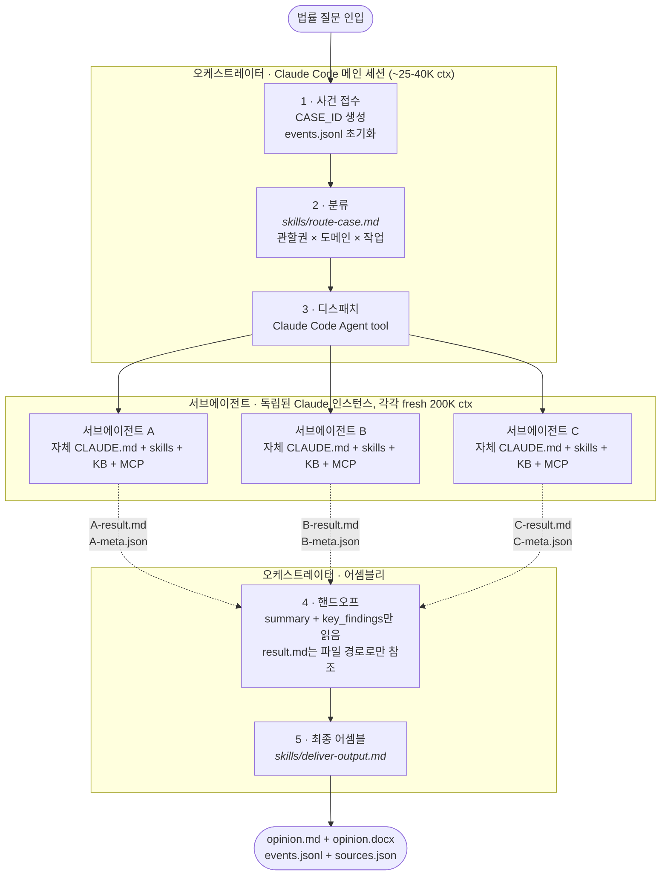
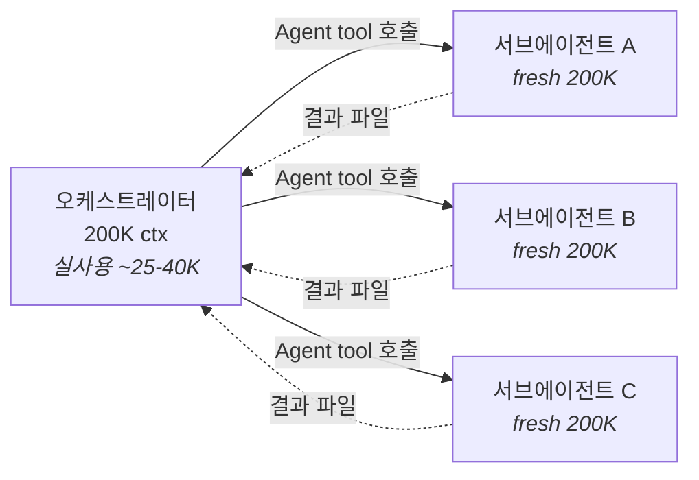

# 법무법인 진주 오케스트레이터 · Jinju Law Firm Orchestrator

**English:** [README.md](README.md)

> Claude Code 위에서 돌아가는 AI 로펌. 8명의 전문 변호사 에이전트가 실제 로펌처럼 협업해서 전 과정이 감사 가능한 법률 의견서를 만든다.


**상태:** Phase 1 E2E 통과 · Phase 2.1/2.2 mini 3건 검증 완료 · Phase 2.3 (멀티라운드 토론) 진행 중.

---

## 개요

시중의 "법률 AI"는 대부분 단일 LLM에 질문을 던지는 구조다. 이 프로젝트는 다르다.

**오케스트레이터가 파트너 변호사 역할**을 맡는다. 들어오는 질문을 분류하고, 적합한 전문 변호사에게 배정하고, 협업 패턴(순차 핸드오프 / 병렬 리서치 / 멀티라운드 토론)을 직접 고른다. 8명의 하위 에이전트는 각자 다른 관할권, 지식 베이스, MCP 도구를 가진 진짜 Claude Code 에이전트이고, 이 프로젝트는 그들을 **단 한 줄도 수정하지 않고 100% 그대로 재활용**한다.

모든 단계는 `events.jsonl`에 기록되어 재생 가능한 아티팩트로 남는다. 어느 변호사가 배정됐는지, 어떤 소스(Grade A/B/C)를 인용했는지, 팩트체커가 뭘 지적했는지 — 전부 보인다.

---

## 작동 방식

법률 질문 하나를 던지면 오케스트레이터가 라우팅하고, 전문가들이 일하고, 의견서가 나온다. 실제 쿼리 하나에서 벌어진 일 — 전체 파일은 [`samples/20260410-012238-391f/`](samples/20260410-012238-391f/):

> **쿼리:** "한국 게임산업법의 확률형 아이템(가챠) 규제에 대한 법률 의견서를 작성해줘"

| 단계 | 에이전트 | 수행한 작업 | 산출물 |
|------|---------|------------|--------|
| **1. 리서치** | 김재식 · `general-legal-research` | `korean-law` MCP로 1차 소스 14건 수집 — 법조문, 넥슨 공정위 116억 과징금 결정, 집행 경로 | [`research-result.md`](samples/20260410-012238-391f/research-result.md) |
| **2. 드래프팅** | 한석봉 · `legal-writing-agent` | 한국 로펌 MEMORANDUM 작성 (결론요약 → 면책조항 → 7개 쟁점 검토 → 리스크 매트릭스 → 8개 권고사항) | [`opinion-v1.md`](samples/20260410-012238-391f/opinion-v1.md) |
| **3. 리뷰** | 반성문 · `second-review-agent` | 모든 블록 인용구를 MCP로 verbatim 대조, **9개 코멘트 반환 (Critical 2 + Major 3 + Minor 4)** — 실제 법조문 원문 불일치 적발 | [`review-result.md`](samples/20260410-012238-391f/review-result.md) |
| **4. 리비전 rescue** | `legal-writing-agent` + 오케스트레이터 | 작성자가 리비전 중 rate limit 발생; 오케스트레이터가 직접 `korean-law` MCP로 수정된 인용구 대조 | [`verbatim-verification.md`](samples/20260410-012238-391f/verbatim-verification.md) |
| **5. 최종 전달** | 오케스트레이터 | 한국 법률 의견서 스타일 가이드(Times New Roman + 맑은 고딕)에 따라 DOCX 어셈블 | [`opinion.docx`](samples/20260410-012238-391f/opinion.docx) |

**결과:** 소스 33건 (Grade A 29 + Grade B 4) · 이벤트 47건 · 리비전 1회 · 승인.

전체 이벤트 타임라인 → [`events.jsonl`](samples/20260410-012238-391f/events.jsonl) · 4개 샘플 케이스 전체의 에이전트별 작업 분해 → [`samples/README.md`](samples/README.md).

### 시스템 다이어그램



### 협업 패턴 3종

| 패턴 | 구조 | 언제 쓰나 | 상태 |
|------|------|----------|------|
| **1 · 병렬 리서치 → 통합** | `[A ∥ B] → writing → review` | 토론까지는 필요 없는 다관할권·다도메인 (예: PIPA + GDPR 컴플라이언스 결합) | ✅ Phase 2.2 검증 |
| **2 · 순차 핸드오프** | `A → writing → review` | 단일 관할권 또는 단일 도메인 (Phase 1 기본) | ✅ Phase 1 E2E 검증 |
| **3 · 멀티라운드 토론** | `A → B 반론 → A 재반론 → writing verdict → review` | 전문가 간 의견 충돌 가능성 있는 다관할권 질문 | 🚧 Phase 2.3 (skeleton) |

Pattern 3가 킬러 피처다. 서로 다른 관할권의 두 전문가가 각자의 지식 베이스를 가진 채 **진짜로 논쟁한다**. 단일 LLM은 이걸 못 한다 — "PIPA 전문가 롤플레이"와 "GDPR 전문가 롤플레이"가 같은 priors에서 나오기 때문. 두 개의 진짜 에이전트는 context가 진짜로 공유되지 않는다.

---

## 왜 이 아키텍처인가

멀티에이전트 업계 표준은 LangGraph · CrewAI · AutoGen · Claude Agent SDK 같은 프레임워크를 웹 서버로 감싸는 것이다. Claude Code 자체를 오케스트레이션 런타임으로 쓰는 건 비주류다. 네 가지 오해부터 풀어야 답이 나온다:

### 1. "에이전트 8개를 한 오케스트레이터에 꾸겨 넣으면 성능 저하 아닌가?"

아니다. Claude Code `Agent` tool이 어떻게 작동하는지에 대한 오해다.

각 서브에이전트는 **완전히 독립된 새 Claude 인스턴스**이며, 200K 컨텍스트 윈도우를 통째로 새로 받는다. 오케스트레이터는 그 무게를 짊어지지 않고 조율만 한다.



오케스트레이터가 쓰는 토큰은 질문 분류, 디스패치 프롬프트, 결과 summary 읽기뿐이다 (총 ~25–40K). 전문가 각각은 자기 CLAUDE.md, 스킬, 지식 베이스, MCP 도구까지 전부 살아 있는 상태로 풀 캐파시티 돌린다. **"꾸겨 넣기"의 반대 — 구조적으로 가능한 가장 context-efficient한 멀티에이전트 설계다.**

### 2. "왜 LangGraph나 Agent SDK를 안 썼나?"

기존 Claude Code 에이전트를 웹 프레임워크로 감싸면 capability의 40~50%가 날아간다: MCP가 끊기고, 스킬 시스템을 재구현해야 하고, KB 탐색 방식이 달라진다. 결국 원본 에이전트의 절반짜리 퀄리티만 뽑는 예쁜 데모가 된다.

그래서 트레이드오프를 뒤집었다: **Claude Code를 런타임으로 쓰고, 에이전트 capability를 100% 보존하고, 시각화는 정적 Case Replay로 분리한다.** 실제 법률 업무가 돌아가는 아키텍처 — 데모가 아니라.

### 3. 프로세스 자체가 프로덕트다

commercial legal AI product는 블랙박스다. 답은 받지만 어떻게 나왔는지 알 수 없다.

법무법인 진주는 정반대다. 어느 변호사가 배정됐는지, 어떤 소스를 참조했는지, 팩트체커가 뭘 지적했는지, 리비전 사이클이 어떻게 해소됐는지 — 전부 `events.jsonl`에 이벤트 단위로 기록된다.

실패 모드까지 영구 기록에 남는다. [Phase 1 E2E 케이스](samples/20260410-012238-391f/events.jsonl)에서 리비전 도중 rate limit 에러(`evt_044`)가 터지자, 오케스트레이터가 직접 나서서 메타 검증 rescue(`evt_045`)를 수행했다. 단일 LLM 시스템에서는 그냥 "모델 에러"로 끝났을 것이 여기서는 append-only 로그의 typed 이벤트로 남는다. **그게 "프로세스 자체가 프로덕트"의 실전 의미다.**

### 4. 그래, 토큰 엄청 태운다 — 의도다

한 건의 케이스는 전문가 한 명당 60K~170K 토큰을 태운다. Phase 1 E2E는 서브에이전트 합산 200K를 훌쩍 넘었다. 이건 버그가 아니다.

각 서브에이전트에게 200K 컨텍스트 윈도우를 통째로 주는 이유는 자기 CLAUDE.md, 필요한 스킬, 지식 베이스를 전부 로드하고 1차 소스에 대해 MCP 라이브 쿼리를 돌릴 여유를 주기 위해서다. 컨텍스트 공유와 공격적 truncation을 쓰면 토큰을 확 줄일 수 있다 — 그리고 퀄리티도 그만큼 확 떨어진다. **목적 함수는 "케이스당 퀄리티"이고, 토큰 비용은 그걸 사기 위한 가격이다.** Claude Code Max에서는 marginal dollar cost가 0이다. 진짜 비용은 벽시계 시간이다.

값싼 법률 챗봇을 원한다면 이 프로젝트는 잘못된 선택이다. **감사 추적 가능한, 방어 가능한 법률 의견서**를 원한다면 저 소모량이 입장료다.

### 비교표

| 측면 | 단일 LLM | LangGraph / Agent SDK | **법무법인 진주** |
|------|---------|----------------------|-------------------|
| 멀티 전문가 추론 | 프롬프트 페르소나 | 프레임워크에 에이전트 재구현 | **진짜 Claude Code 에이전트, 100% 재활용** |
| 지식 베이스 | 컨텍스트에 꾸겨 넣기 | 프레임워크용으로 재구축 | 각 에이전트의 네이티브 KB 그대로 |
| MCP / 1차 소스 | 호출자 도구 상속 | 서버사이드 재배선 | 각 에이전트 자기 MCP 유지 |
| 팩트체커 | 없거나 임시방편 | 커스텀 구현 | 자체 CLAUDE.md 가진 실제 `second-review-agent` |
| 감사 추적 | 채팅 로그 | 커스텀 로깅 | 케이스당 네이티브 `events.jsonl` |
| 다관할권 토론 | 한 모델이 양쪽 롤플레이 | 순차 상태 머신 | 병렬 디스패치 + 메타 검증 fallback |
| 데모 영속성 | 탭 닫히면 끝 | 서버 띄워야 함 | `cat`할 수 있는 정적 파일 |

---

## 에이전트 로스터

| # | Agent ID | 담당 변호사 | 관할권 | 역할 |
|---|----------|------------|--------|------|
| 1 | `general-legal-research` | 김재식 | KR | 범용 법률 리서치 |
| 2 | `legal-writing-agent` | 한석봉 | KR | 한국 로펌 MEMORANDUM 형식으로 의견서 작성 |
| 3 | `second-review-agent` | 반성문 (파트너) | KR | 품질 검토 파트너 — MCP verbatim 대조, Critical/Major/Minor 코멘트 |
| 4 | `PIPA-expert` | 정보호 | KR | 한국 개인정보보호법 전문가 |
| 5 | `GDPR-expert` | 김덕배 | EU | EU 데이터보호법 전문가 |
| 6 | `game-legal-research` | 심진주 | KR + 국제 | 게임법 전문가 (확률형 아이템, 라이브 서비스, 콘텐츠 규제) |
| 7 | `contract-review-agent` | 고덕수 | KR | 상사계약서 검토 |
| 8 | `legal-translation-agent` | 변혁기 | KR / EN | 법률문서 번역, 어조·인용 형식 보존 |

각 에이전트는 독립된 GitHub 리포지토리에 호스팅된다. `setup.sh`가 자동 클론한다. **오케스트레이터는 하위 에이전트의 `CLAUDE.md`를 절대 수정하지 않는다** — 이것이 "100% 재활용"의 실천이다.

---

## 빠른 시작

```bash
# 1. 사전 조건: Claude Code (Max 구독 권장), Python 3.10+, 법제처 Open API 계정

git clone https://github.com/kipeum86/legal-agent-orchestrator.git
cd legal-agent-orchestrator

# 2. API 키 설정 (쉘 세션마다 필요 — Claude Code는 .env 자동 로드 X)
export LAW_OC=your_law_oc_key

# 3. 8개 하위 에이전트 설치
./setup.sh

# 4. Claude Code 실행; CLAUDE.md와 .mcp.json 자동 로드
claude
```

이제 법률 질문을 던져보자. 결과는 `output/{CASE_ID}/`에 `events.jsonl`, 에이전트별 `result.md`/`meta.json`, 최종 `opinion.md` + `opinion.docx`로 저장된다.

---

## 진행 상황 & 로드맵

- [x] **Phase 0** — 기술 스파이크 (Agent tool, MCP, 병렬 실행)
- [x] **Phase 1** — 3 에이전트 기본 파이프라인 + E2E ([샘플 케이스](samples/20260410-012238-391f/))
- [x] **Phase 2.1** — 전문가 라우팅 ([`skills/route-case.md`](skills/route-case.md) v2, 637줄)
- [x] **Phase 2.2** — Pattern 1 병렬 디스패치 (3 mini 검증 — [`samples/README.md`](samples/README.md))
- [x] **Phase 2.2 후속** — PIPA-expert `library/grade-b/` 보강 (landmark 30건: 법령해석례 20 + 대법원 판례 10, [kipeum86/PIPA-expert@6b8137c](https://github.com/kipeum86/PIPA-expert/commit/6b8137c))
- [ ] **Phase 2.3** — Pattern 3 멀티라운드 토론 (킬러 피처)
- [ ] **Phase 3** — Case Replay (Next.js 정적 뷰어)
- [ ] 8개 하위 에이전트 public 배포

---

## FAQ

**프로덕션에 쓸 수 있나요?**
아니요. 포트폴리오/연구 프로젝트입니다. Phase 1 E2E 의견서 초안은 한국 변호사가 편집해서 넘길 수 있을 수준의 실제 MEMORANDUM이지만, 실제 클라이언트 업무에 쓰려면 자격 있는 변호사의 검토, 관할권 면책조항, 소속 로펌의 엔게이지먼트 정책 준수가 필요합니다.

**클라이언트 기밀은 어떻게 보호하나요?**
모든 실행은 사용자의 로컬 머신에서 사용자 본인의 Claude Code 세션으로 이루어집니다. 중간 SaaS가 없습니다. 다만 Claude Code 자체가 추론을 위해 Anthropic에 프롬프트를 보내므로, 특정 사안에 그게 허용되는지는 소속 로펌 정책에 따라 다릅니다. `output/`, `agents/`, `.env`는 gitignored라서 케이스 파일과 API 키가 커밋에 새어나가지 않습니다.

**제 전문 에이전트를 추가할 수 있나요?**
네. 독립된 Claude Code 에이전트로 작성하고 `agents/` 아래에 drop (또는 심볼릭 링크) 후 [`skills/route-case.md`](skills/route-case.md)에 한 행 추가하면 됩니다. 오케스트레이터 변경은 불필요합니다. plugin 모양으로 설계되어 있습니다.

**의견서 한 건에 얼마 드나요?**
Claude Code Max: marginal dollar cost 0. 종량제 API: 복잡도와 리비전 사이클에 따라 대략 $3~10. 진짜 비용은 벽시계 시간(파이프라인당 5~15분).

---

## 프로젝트 구조

```
legal-agent-orchestrator/
├── CLAUDE.md                           # 오케스트레이터 시스템 프롬프트
├── .mcp.json                           # MCP 서버 설정 (korean-law + kordoc)
├── setup.sh                            # 에이전트 클론/링크 관리
├── skills/
│   ├── route-case.md                   # 분류 + 파이프라인 선택
│   ├── deliver-output.md               # 최종 어셈블리
│   └── manage-debate.md                # Phase 2.3 토론 (skeleton)
├── scripts/
│   └── md-to-docx.py                   # DOCX 변환 (이중 폰트 한국어 스타일 가이드 §11)
├── agents/                             # 8 하위 에이전트 (gitignored)
├── output/                             # 런타임 케이스 아티팩트 (gitignored)
├── samples/                            # 포트폴리오 증거용 frozen 샘플
│   ├── README.md                       # 4개 샘플의 에이전트별 작업 분해
│   └── ...
└── docs/
    └── legal-writing-formatting-guide.md # 한국어 법률 의견서 스타일 정본
```

---

## 라이선스

**Apache License 2.0** — [LICENSE](LICENSE) 참조.

하위 에이전트는 각자 리포지토리에서 별도의 라이선스를 따른다. 법률 데이터는 법제처 공개 API와 대한민국 법원 판결문(공공저작물)에서 수집한다.
