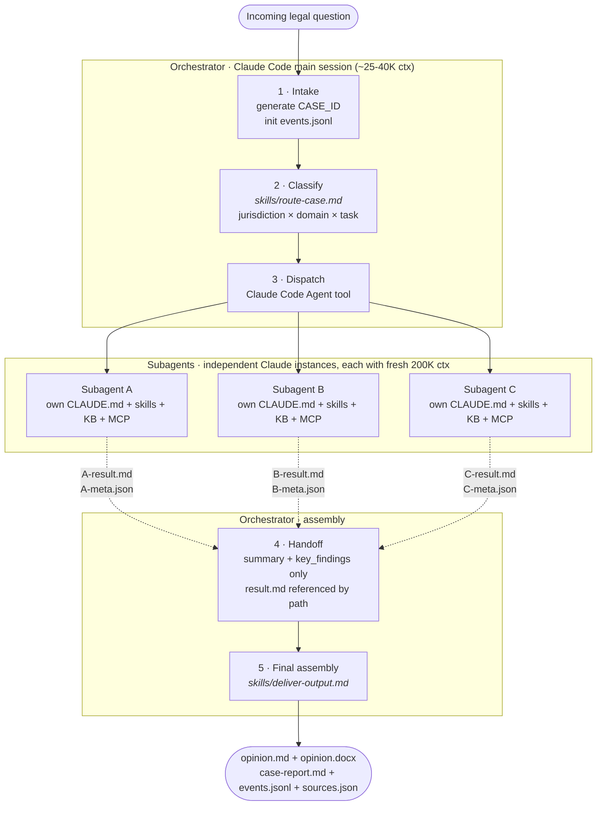
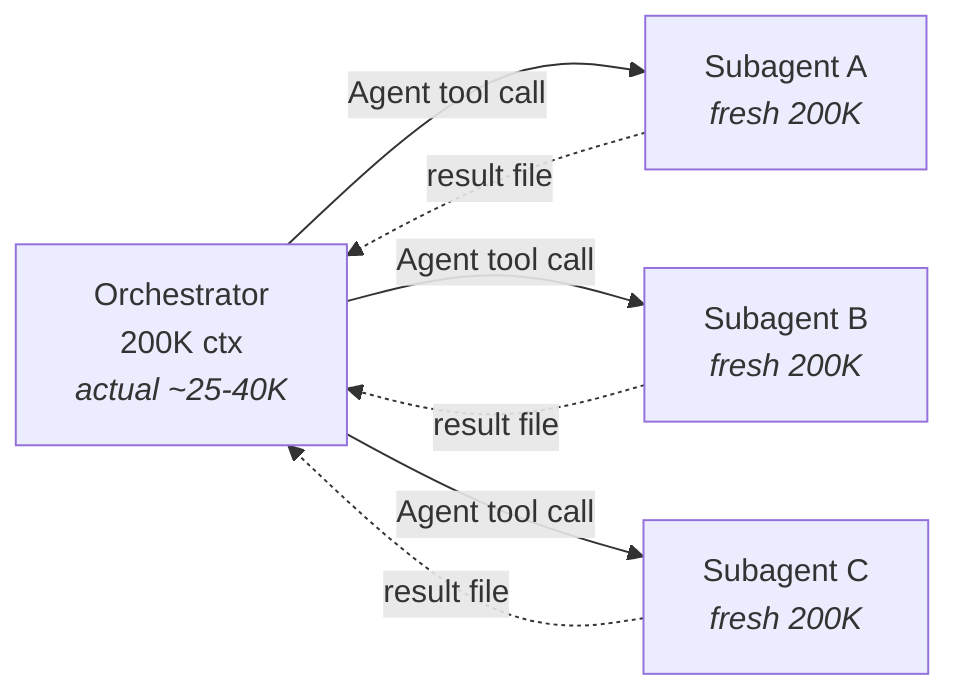

# KP Legal Orchestrator · KP 리걸 오케스트레이터

**한국어:** [README.ko.md](README.ko.md)

> An AI-based legal workflow system running on Claude Code. Eight specialist agents collaborate to produce audit-friendly legal analysis with transparent process logs.
>
> Disclaimer: This repository supports legal research, drafting, review, and workflow orchestration. It is designed as an AI workflow system for legal work and should not be relied on as a substitute for advice from qualified counsel in the relevant jurisdiction. AI outputs may contain errors, inaccurate citations, or incomplete analysis, and no attorney-client relationship is created through use of this repository.


---

## Overview

Most "legal AI" products are a single LLM you throw questions at. This one is different.

The **lead orchestrator** classifies each incoming question, routes it to the right specialist agent, and picks the collaboration pattern (sequential handoff / parallel research / multi-round debate). The six subordinate agents are real Claude Code agents — each with its own jurisdiction, knowledge base, and MCP tools — and this project reuses them **100% unmodified**.

Every step is logged to `events.jsonl`, and the final delivery step folds the whole case folder into a single `case-report.md`. Which specialist was assigned, which sources (Grade A/B/C) were cited, what the fact-checker flagged, and how revisions resolved — it's all visible in one narrative artifact.

---

## Meet the Team — KP Legal Orchestrator Specialist Agents

This repository is the central coordinator for **KP Legal Orchestrator**, a fictional AI legal workflow system. Each of the six specialists below lives in its own independent GitHub repository as a standalone Claude Code agent. When you run `./setup.sh` they are all cloned into `agents/` and ready to be dispatched.

| Specialist | Agent repository | What they actually do |
|----------|------------------|-----------------------|
| **Legal Research Specialist** | [legal-research-agent](https://github.com/kipeum86/legal-research-agent) | Source-first legal research across general legal questions and game-industry regulation. Four explicit research modes (`general` / `game_regulation` / `game_plus_general` / `fallback`) injected by the orchestrator. Grade-A primary-source-first workflow over 17+ jurisdictions. |
| **Legal Writing Specialist** | [legal-writing-agent](https://github.com/kipeum86/legal-writing-agent) | Bilingual (KR/EN) drafter for **non-contract** legal documents. Drafts via a D1–D6 pipeline, revises via an R1–R7 tracked-change pipeline. Korean drafts follow 쟁점→결론→분석 conventions; English drafts follow IRAC/CRAC with Bluebook/OSCOLA. |
| **Senior Review Specialist** | [second-review-agent](https://github.com/kipeum86/second-review-agent) | Final quality gate for AI-generated legal documents. Verifies citations against primary legal databases (law.go.kr, congress.gov, eur-lex, and more), checks legal logic, and ships redlined DOCX with tracked changes. Independent release gate (Pass / Pass with Warnings / Manual Review Required / Not Recommended). Zero tolerance for hallucinated citations. |
| **Data Protection Specialist** | [data-protection-agent](https://github.com/kipeum86/data-protection-agent) | Unified KR PIPA, EU GDPR, and California CCPA/CPRA specialist with namespaced local KBs, deterministic retrieval, and golden-set evaluation. Single agent for cross-jurisdiction privacy work. |
| **Contract Review Specialist** | [contract-review-agent](https://github.com/kipeum86/contract-review-agent) | Contract review pipeline — drop a contract in, get back a **DOCX with tracked-change redlines, margin comments (internal strategy + external-facing), a full analysis report, and negotiation recommendations**. Node.js + Python stack. Final legal judgment stays with the human. |
| **Legal Translation Specialist** | [legal-translation-agent](https://github.com/kipeum86/legal-translation-agent) | Legal document translation across **5 languages** with zero-omission guarantee and dual-pass translation merged via comparative synthesis. Jurisdiction-aware terminology (BGB, UCC, PRC, Taiwan, APPI) and a persistent shared translation memory that grows with every job. |

**The orchestrator never modifies a subordinate agent's `CLAUDE.md`, skills, or knowledge base.** That's what "100% reuse" means in practice. Subordinate agents are tracked at the `main` branch of their respective GitHub repositories — `./setup.sh` shallow-clones them and `./setup.sh update` fast-forwards each one to the latest `main`. **Every new case automatically runs `./setup.sh update` at intake**, so when a specialist ships a bug fix the next case picks it up without any user action (set `LEGAL_ORCHESTRATOR_SKIP_AGENT_SYNC=1` to opt out).

> `setup.sh` only clones the repositories used directly by this orchestrator. Standalone projects outside this workflow are not included.

---

## How It Works

Send a legal question. The orchestrator routes it, the specialists do the work, and you get an opinion. A typical pipeline looks like this:

| Stage | Agent | What it did | Output |
|-------|-------|-------------|--------|
| **1. Research** | Legal Research Specialist · `legal-research-agent` | Pulls primary sources from the relevant MCP and legal databases — statute text, precedents, regulator guidance, and enforcement path. Mode (`general` / `game_regulation` / etc.) is selected by the orchestrator from the classification | `{agent}-result.md`, `{agent}-meta.json` |
| **2. Drafting** | Legal Writing Specialist · `legal-writing-agent` | Produces the first opinion draft in a structured legal memorandum format | `opinion.md` |
| **3. Review** | Senior Review Specialist · `second-review-agent` | Runs verbatim source checks, identifies mismatches, and returns severity-ranked comments | `review-result.md`, `review-meta.json` |
| **4. Revision rescue** | `legal-writing-agent` + orchestrator | If revision stalls, the orchestrator can take over and verify citations directly against primary sources | `verbatim-verification.md` |
| **5. Delivery** | orchestrator | Validates the case folder, gates delivery on review approval, merges sources, and generates client-facing files | `opinion.docx`, `sources.json`, `case-report.md` |

**Result:** audited sources, a typed event log, review findings, and a final deliverable bundle.

### System diagram



### Three collaboration patterns

| Pattern | Shape | When | Status |
|---------|-------|------|--------|
| **1 · Parallel research → merge** | `[A ∥ B] → writing → review` | Cross-domain or cross-jurisdiction that doesn't need debate (e.g. GDPR + international game-regulation analysis for an EU market launch) | ✅ validated Phase 2.2 |
| **2 · Sequential handoff** | `A → writing → review` | Single-jurisdiction or focused domain work (Phase 1 default) | ✅ validated Phase 1 E2E |
| **3 · Multi-round debate** | `[A ∥ B] → rebuttal rounds → deterministic transcript → writing verdict → review` | Cross-jurisdiction questions where specialists are likely to disagree | ✅ control plane validated |

Pattern 3 is the killer feature — two specialists from different jurisdictions, each with their own knowledge base, actually argue. No single LLM can genuinely produce that kind of depth because "role-playing two different foreign-law specialists" still comes from the same priors. Two real agents genuinely don't share context. The orchestration control plane now builds the debate transcript deterministically from round files and decides whether Round 3 is needed from recorded concessions, so the debate shape is reproducible instead of improvised.

---

## Why This Architecture

The standard playbook for multi-agent systems is to wrap a framework (LangGraph, CrewAI, AutoGen, Claude Agent SDK) in a web server. Using Claude Code itself as the orchestration runtime is non-standard. Four misconceptions usually come up first:

### 1. "Doesn't stuffing 6 agents into one orchestrator kill performance?"

No — that's a misconception about how Claude Code's `Agent` tool works.

Each subagent is a **completely independent new Claude instance** with its own fresh 200K context window. The orchestrator doesn't carry their weight — it just coordinates.



The orchestrator spends tokens only on classification, dispatch prompts, and reading result summaries (~25–40K total). Each specialist runs at full capacity with its own CLAUDE.md, skills, knowledge base, and MCP tools. **This is the opposite of "stuffing" — it's the most context-efficient multi-agent architecture possible.**

### 2. "Why not LangGraph or Agent SDK?"

Wrapping existing Claude Code agents in a web framework loses 40–50% of their capability: MCP breaks, the skills system needs reimplementation, knowledge-base browsing changes. You end up with a pretty demo producing legal opinions at half quality.

We inverted the tradeoff: **Claude Code as the runtime, agents preserved 100% intact, and final delivery collapsed into a single `case-report.md` artifact instead of a web UI.** Real legal work, not a demo.

### 3. The Process Is the Product

Most commercial legal AI products are black boxes. You get an answer; you don't know how.

KP Legal Orchestrator is the opposite. Which specialist was assigned, which sources were consulted, what the fact-checker flagged, how revision cycles resolved — all visible in `events.jsonl`, one line per event.

Failure modes are in the permanent record too. If a mid-revision rate-limit error occurs, the orchestrator can trigger a meta-verification rescue instead of dying as a dead chat tab. Here it's a typed event in an append-only log. **That's what "the process is the product" means in practice.**

### 4. Yes, it burns a lot of tokens — on purpose

A single case can consume 60K–170K tokens per specialist. Phase 1 E2E burned north of 200K across all subagents. That's not a bug.

Every subagent gets its own full 200K context window so it can load its CLAUDE.md, every skill it needs, its knowledge base, and run live MCP queries against primary sources. Context-sharing and aggressive truncation could cut token usage sharply — and would degrade quality by roughly the same amount. **Quality-per-case is the objective function; token spend is the price we pay for it.** On Claude Code Max, the marginal dollar cost is zero. The real cost is wall-clock time.

If you want a cheap legal chatbot, this is the wrong project. If you want a defensible legal opinion with a full audit trail, that burn rate is the price of admission.

### Comparison

| Aspect | Single LLM | LangGraph / Agent SDK | **KP Legal Orchestrator** |
|--------|-----------|----------------------|---------------------|
| Multi-specialist reasoning | Prompt personas | Agents reimplemented in the framework | **Real Claude Code agents, 100% reused** |
| Knowledge bases | Stuffed into context | Rebuilt for the framework | Each agent's native KB, untouched |
| MCP / primary sources | Inherits caller's tools | Rewired server-side | Each agent keeps its own MCP config |
| Fact-checker | None, or bolted on | Custom implementation | Real `second-review-agent` with its own CLAUDE.md |
| Audit trail | Chat log | Custom logging layer | Native `events.jsonl` per case |
| Cross-jurisdiction debate | One model playing both sides | Sequential state machine | Parallel dispatch + meta-verification fallback |
| Demo persistence | Dies with the tab | Requires a running server | Static files you can `cat` |

---

## Getting Started

### Prerequisites

- **[Claude Code](https://docs.claude.com/claude-code)** installed and logged in. Max subscription strongly recommended — a single case can burn 200K+ tokens across subagents, and on metered API pricing that adds up. On Max, marginal cost is zero.
- **macOS or Linux** with `git`, `bash` or `zsh`, and `python3` (3.10+).
- **[법제처 Open API](https://open.law.go.kr/) account.** Free, sign up with an email. You'll get an `LAW_OC` key which the `korean-law` MCP server uses to query Korean statutes, precedents, and administrative interpretations in real time.

### 1. Clone the orchestrator

```bash
git clone https://github.com/kipeum86/legal-agent-orchestrator.git
cd legal-agent-orchestrator
```

What you have now: the orchestrator itself — `CLAUDE.md` (the lead orchestrator system prompt), `.mcp.json` (MCP server config), `skills/` (routing and assembly logic), and `setup.sh`. The six subordinate agents are **not yet installed**.

### 2. Install the six subordinate agents

```bash
./setup.sh
```

This script shallow-clones all six specialists' GitHub repositories into `agents/` under their Agent ID names, tracking each one's `main` branch:

```
agents/
├── legal-research-agent/       ← Legal Research Specialist (general + game)
├── legal-writing-agent/        ← Legal Writing Specialist
├── second-review-agent/        ← Senior Review Specialist
├── data-protection-agent/      ← Data Protection Specialist
├── contract-review-agent/      ← Contract Review Specialist
└── legal-translation-agent/    ← Legal Translation Specialist
```

Each folder is an independent Claude Code agent with its own `CLAUDE.md`, `skills/`, knowledge base, and MCP configuration. When the orchestrator dispatches a case, it calls into these agents via Claude Code's `Agent` tool with `cwd: agents/{agent-id}/`, so each subagent runs in its own working directory with its own context.

Other `setup.sh` commands:
- `./setup.sh update` — fast-forward every agent to the latest `main` of its upstream repository (idempotent; same as the default `./setup.sh`). **The orchestrator runs this automatically at the start of every case.**
- `./setup.sh status` — show each agent's local SHA next to the upstream `main` SHA, and flag any that are `behind` / `up to date` / `unreachable` / `symlink` (dev mode)
- `./setup.sh link` — **development mode**: if you already have the agent repositories checked out under `~/코딩 프로젝트/`, create symlinks instead of fresh clones so your local edits flow through immediately

Each agent is shallow-cloned (`--depth 1 --single-branch`), so only the latest snapshot of `main` lives on disk — no git history, no other branches.

### Smoke checks

Before committing orchestrator changes, run the checks in [CONTRIBUTING.md](CONTRIBUTING.md):

```bash
python3 -m unittest
python3 scripts/sanitize-check.py --self-test
python3 scripts/smoke-check.py
```

### 3. Set your Korean Open Law API key

```bash
export LAW_OC=your_law_oc_key
```

⚠️ This is required **every shell session**. Claude Code does not auto-load `.env`, and without `LAW_OC` the `korean-law` MCP server will fail to answer the first statute lookup. The simplest solution is to put `export LAW_OC=...` in your `~/.zshrc` or `~/.bashrc`.

### 4. Launch Claude Code from the orchestrator directory

```bash
claude
```

When Claude Code starts, it auto-loads:
- **[CLAUDE.md](CLAUDE.md)** — the orchestrator system prompt that tells the main Claude session "you are the lead orchestrator of KP Legal Orchestrator, here is your workflow, here are your six specialists, here are the skills you can invoke"
- **[.mcp.json](.mcp.json)** — the MCP servers available (`korean-law` and `kordoc`); each subagent inherits these on dispatch
- **`skills/*.md`** — markdown procedure documents the orchestrator executes as subroutines

You're now talking to the lead orchestrator. Ask a legal question in Korean or English.

### 5. Your first case

Try one of these:

```
독일 본사의 SaaS 회사가 프랑스·이탈리아 사용자 데이터를 미국 subprocessors로
이전하려고 합니다. SCC만으로 충분한가요, 추가 보호조치가 필요한가요?
```

```
Our Delaware-incorporated AI health startup stores EU patient data in
Ireland and wants to transfer model-training datasets to U.S.
infrastructure. What transfer mechanism and supplementary measures are
required after Schrems II?
```

What happens next:
1. The orchestrator classifies the question (jurisdiction × domain × task), picks a pipeline, creates `$OUTPUT_DIR`, and starts appending to `events.jsonl`. By default `$OUTPUT_DIR` is `output/{CASE_ID}/`; if `LEGAL_ORCHESTRATOR_PRIVATE_DIR` is set, case files are written there instead.
2. It dispatches the first subagent via `Agent` tool. You'll see the subagent run in a nested context — calling MCP, reading its KB, writing results.
3. Control returns to the orchestrator, which reads the subagent's compact `{agent}-meta.json` summary, issue map, and graded sources before dispatching the next agent in the pipeline.
4. When all agents finish, `skills/deliver-output.md` validates the case folder, checks senior-review approval, merges `sources.json`, assembles `opinion.md`, converts it to `opinion.docx`, and generates `case-report.md`.

Expect 5–15 minutes of wall-clock time per case. The orchestrator is not trying to minimize latency — it's trying to minimize the number of things you have to manually double-check afterwards.

### 6. Find your results

```
$OUTPUT_DIR/  # defaults to output/{CASE_ID}/
├── events.jsonl            ← full timeline, one event per line
├── {agent}-result.md       ← each subagent's detailed analysis
├── {agent}-meta.json       ← compact summary + issue map + graded sources
├── sources.json            ← merged source table with grade distribution
├── opinion.md              ← final opinion in markdown
├── debate-opinion.md       ← Pattern 3 verdict, when debate is used
├── debate-transcript.md    ← deterministic debate transcript, when debate is used
├── case-report.md          ← single-file narrative case archive
└── opinion.docx            ← final opinion as DOCX (client-ready)
```

### 7. Generate `case-report.md`

The orchestrator does not ship a web viewer anymore. Instead, every completed case can be collapsed into a single Markdown archive that renders directly on GitHub.

Generate it manually for a completed live case:

```bash
python3 "$PROJECT_ROOT/scripts/generate-case-report.py" "$OUTPUT_DIR"
```

You can also pass a bare case ID. In that form, the script resolves it under `LEGAL_ORCHESTRATOR_PRIVATE_DIR` when set, otherwise under `output/`.

`skills/deliver-output.md` now calls this automatically at the final delivery step, so completed cases should end with:

- `opinion.md`
- `opinion.docx`
- `sources.json`
- `events.jsonl`
- `case-report.md`

The generated report is designed to be the one file you open first. It includes:
- case metadata and status
- human-readable timeline derived from `events.jsonl`
- participating specialists and their contributions
- partner review findings grouped by severity
- source table with grade breakdown
- the final opinion inlined under one document
- relative links to the original raw artifacts

---

## FAQ

**How does it handle client confidentiality?**
Everything runs locally on your machine under your own Claude Code session. No intermediate SaaS. Claude Code itself sends prompts to Anthropic for inference — whether that's acceptable for a given matter depends on your firm. `output/`, `agents/`, and `.env` are gitignored so case files and API keys don't leak into commits.

**What does `./setup.sh` actually do to my machine?**
It creates an `agents/` folder inside this repository and clones six GitHub repositories into it, one per specialist agent. Nothing outside this directory is touched. No global package installs, no environment mutations beyond whatever `git clone` does. Each agent folder is roughly 10–80 MB depending on its knowledge base size.

**Can I add my own specialist agent?**
Yes. Write it as a standalone Claude Code agent (its own `CLAUDE.md`, `skills/`, optional `library/`, optional `.mcp.json`), drop it under `agents/` (or symlink it), add one line to the `REPOS` array in `setup.sh`, and add one row to [`skills/route-case.md`](skills/route-case.md) so the router knows when to call it. No orchestrator code changes needed. The design is plugin-shaped.

**How much does it cost per opinion?**
On Claude Code Max: zero marginal dollars. On metered API pricing: roughly $3–10 per opinion depending on complexity. The real cost is wall-clock time (5–15 minutes per pipeline).

---

## Project Structure

```
legal-agent-orchestrator/
├── CLAUDE.md                           # orchestrator system prompt
├── .mcp.json                           # MCP server config (korean-law + kordoc)
├── setup.sh                            # shallow-clone / update / link commands for subordinate agents
├── CONTRIBUTING.md                     # local smoke-check workflow
├── MCP_VERSION_CHANGELOG.md            # MCP pin and smoke-test history
├── skills/
│   ├── route-case.md                   # classification + pipeline selection
│   ├── deliver-output.md               # final assembly + case-report generation handoff
│   ├── generate-case-report.md         # single-file case archive generation
│   ├── manage-debate.md                # Pattern 3 debate orchestration
│   └── prompt-templates/               # reusable dispatch prompt blocks
├── scripts/
│   ├── log-event.py                    # typed events.jsonl writer
│   ├── select-route.py                 # deterministic routing helper
│   ├── validate-case.py                # event/meta contract validation
│   ├── merge-sources.py                # sources.json generation
│   ├── finalize-case.py                # review approval gate + final_output event
│   ├── build-debate-transcript.py      # deterministic Pattern 3 transcript builder
│   ├── decide-debate-round3.py         # deterministic Round 3 decision
│   ├── sanitize-check.py               # trust-boundary and deliverable residue scan
│   ├── md-to-docx.py                   # DOCX conversion (dual-font Korean style guide §11)
│   ├── generate-case-report.py         # narrative case-report.md generator
│   ├── smoke-check.py                  # clean-tree smoke checks
│   └── acceptance-check.py             # remediation acceptance checks
├── schemas/                            # JSON schemas for events, meta, routing, review
├── tests/                              # unit tests and fixture cases
├── agents/                             # 9 subordinate agents (gitignored, populated by setup.sh)
├── output/                             # live case artifacts (gitignored)
└── docs/
    └── legal-writing-formatting-guide.md # canonical Korean legal opinion style guide
```

---

## License

**Apache License 2.0** — see [LICENSE](LICENSE).

Subordinate agents are hosted in separate repositories with their own licenses. Legal data comes from Korean Ministry of Government Legislation public APIs and court judgments (public-domain government works).
