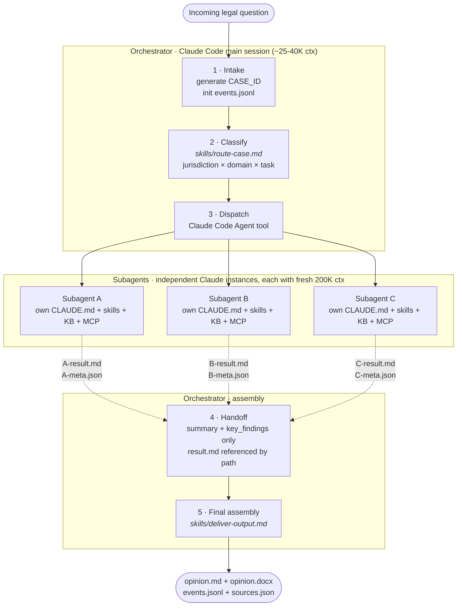
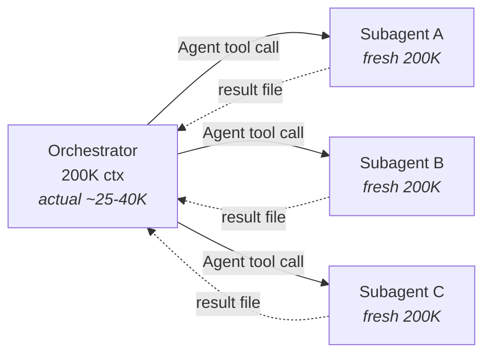

# Jinju Law Firm Orchestrator · 법무법인 진주

**한국어:** [README.ko.md](README.ko.md)

> An AI law firm running on Claude Code. Eight specialist lawyer agents collaborate like a real firm to produce legal opinions with full audit trails.


**Status:** Phase 1 E2E passed · Phase 2.1/2.2 validated with 3 mini runs · Phase 2.3 (multi-round debate) in progress.

---

## Overview

Most "legal AI" products are a single LLM you throw questions at. This one is different.

An **orchestrator plays the role of managing partner**. It classifies each incoming question, routes it to the right specialist lawyer, and picks the collaboration pattern (sequential handoff / parallel research / multi-round debate). The eight subordinate agents are real Claude Code agents — each with its own jurisdiction, knowledge base, and MCP tools — and this project reuses them **100% unmodified**.

Every step is logged to `events.jsonl`, producing a replayable artifact. Which lawyer was assigned, which sources (Grade A/B/C) were cited, what the fact-checker flagged — it's all visible.

---

## Meet the Team — 법무법인 진주 소속 에이전트

This orchestrator is the **main office** of a fictional Korean law firm, 법무법인 진주 (Jinju Law Firm). Each of the eight attorneys below lives in its own independent GitHub repository as a standalone Claude Code agent. When you run `./setup.sh` they are all cloned into `agents/` and ready to be dispatched.

| Attorney | Agent repository | Specialty | Phase |
|----------|------------------|-----------|-------|
| **김재식 (Kim Jaesik)** | [general-legal-research](https://github.com/kipeum86/general-legal-research) | Generalist legal research across any Korean law domain | Phase 1 ✓ |
| **한석봉 (Han Seokbong)** | [legal-writing-agent](https://github.com/kipeum86/legal-writing-agent) | Legal drafting in Korean law-firm memorandum format | Phase 1 ✓ |
| **반성문 (Ban Seong-mun)** · *Partner* | [second-review-agent](https://github.com/kipeum86/second-review-agent) | Quality review — verbatim MCP checks, Critical/Major/Minor comments, final sign-off | Phase 1 ✓ |
| **정보호 (Jeong Bo-ho)** | [PIPA-expert](https://github.com/kipeum86/PIPA-expert) | Korean Personal Information Protection Act (개인정보보호법) specialist with dedicated PIPA/PIPC knowledge base | Phase 2 ✓ |
| **김덕배 (Kim De Bruyne)** | [GDPR-expert](https://github.com/kipeum86/GDPR-expert) | EU General Data Protection Regulation specialist (Chapter V transfers, Schrems II, EDPB guidance) | Phase 2 ✓ |
| **심진주 (Sim Jinju)** | [game-legal-research](https://github.com/kipeum86/game-legal-research) | International gaming law — loot boxes, live-service regulation, cross-border content rules | Phase 2 ✓ |
| **고덕수 (Ko Duksoo)** | [contract-review-agent](https://github.com/kipeum86/contract-review-agent) | Commercial contract review under Korean law (SaaS, NDA, employment, license) | Phase 2 |
| **변혁기 (Byeon Hyeok-gi)** | [legal-translation-agent](https://github.com/kipeum86/legal-translation-agent) | Legal document translation (KR ↔ EN), tone and citation format preserved | Phase 2 |

**The orchestrator never modifies a subordinate agent's `CLAUDE.md`, skills, or knowledge base.** That's what "100% reuse" means in practice. If an attorney ships a bug fix to their own repo, it flows through here on the next `./setup.sh update`.

> Two briefing-style agents (`game-legal-briefing`, `game-policy-briefing`) exist in the same author's GitHub org but are standalone Python apps outside this orchestrator's scope and are not cloned by `setup.sh`.

---

## How It Works

Send a legal question. The orchestrator routes it, the specialists do the work, and you get an opinion. Here is what happened on one real query — full files at [`samples/20260410-012238-391f/`](samples/20260410-012238-391f/):

> **Query:** "한국 게임산업법의 확률형 아이템(가챠) 규제에 대한 법률 의견서를 작성해줘"

| Stage | Agent | What it did | Output |
|-------|-------|-------------|--------|
| **1. Research** | 김재식 · `general-legal-research` | Pulled 14 primary sources from `korean-law` MCP — statute text, the KFTC ₩11.6B Nexon decision, enforcement path | [`research-result.md`](samples/20260410-012238-391f/research-result.md) |
| **2. Drafting** | 한석봉 · `legal-writing-agent` | Wrote a Korean law-firm memorandum (summary → disclaimer → 7 issue analyses → risk matrix → 8 recommendations) | [`opinion-v1.md`](samples/20260410-012238-391f/opinion-v1.md) |
| **3. Review** | 반성문 · `second-review-agent` | Ran verbatim MCP checks on every block quote, returned **9 comments (2 Critical + 3 Major + 4 Minor)** — including a real statute-text mismatch | [`review-result.md`](samples/20260410-012238-391f/review-result.md) |
| **4. Revision rescue** | `legal-writing-agent` + orchestrator | Writer hit a rate limit mid-revision; orchestrator took over and cross-checked the fixed citations directly against `korean-law` MCP | [`verbatim-verification.md`](samples/20260410-012238-391f/verbatim-verification.md) |
| **5. Delivery** | orchestrator | Assembled final DOCX (Times New Roman + 맑은 고딕 per the Korean legal style guide) | [`opinion.docx`](samples/20260410-012238-391f/opinion.docx) |

**Result:** 33 sources (29 Grade A + 4 Grade B) · 47 events · 1 revision cycle · approved.

Full event timeline → [`events.jsonl`](samples/20260410-012238-391f/events.jsonl) · Agent-by-agent deep dive for all 4 sample cases → [`samples/README.md`](samples/README.md).

### System diagram



### Three collaboration patterns

| Pattern | Shape | When | Status |
|---------|-------|------|--------|
| **1 · Parallel research → merge** | `[A ∥ B] → writing → review` | Cross-domain or cross-jurisdiction that doesn't need debate (e.g. PIPA + GDPR combined compliance) | ✅ validated Phase 2.2 |
| **2 · Sequential handoff** | `A → writing → review` | Single-jurisdiction or focused domain work (Phase 1 default) | ✅ validated Phase 1 E2E |
| **3 · Multi-round debate** | `A → B rebuts → A counters → writing verdict → review` | Cross-jurisdiction questions where specialists are likely to disagree | 🚧 Phase 2.3 (skeleton) |

Pattern 3 is the killer feature — two specialists from different jurisdictions, each with their own knowledge base, actually argue. No single LLM can genuinely produce that kind of depth because "role-playing a PIPA expert" and "role-playing a GDPR expert" come from the same priors. Two real agents genuinely don't share context.

---

## Why This Architecture

The standard playbook for multi-agent systems is to wrap a framework (LangGraph, CrewAI, AutoGen, Claude Agent SDK) in a web server. Using Claude Code itself as the orchestration runtime is non-standard. Four misconceptions usually come up first:

### 1. "Doesn't stuffing 8 agents into one orchestrator kill performance?"

No — that's a misconception about how Claude Code's `Agent` tool works.

Each subagent is a **completely independent new Claude instance** with its own fresh 200K context window. The orchestrator doesn't carry their weight — it just coordinates.



The orchestrator spends tokens only on classification, dispatch prompts, and reading result summaries (~25–40K total). Each specialist runs at full capacity with its own CLAUDE.md, skills, knowledge base, and MCP tools. **This is the opposite of "stuffing" — it's the most context-efficient multi-agent architecture possible.**

### 2. "Why not LangGraph or Agent SDK?"

Wrapping existing Claude Code agents in a web framework loses 40–50% of their capability: MCP breaks, the skills system needs reimplementation, knowledge-base browsing changes. You end up with a pretty demo producing legal opinions at half quality.

We inverted the tradeoff: **Claude Code as the runtime, agents preserved 100% intact, visualization decoupled into static Case Replay.** Real legal work, not a demo.

### 3. The Process Is the Product

commercial legal AI product is a black box. You get an answer; you don't know how.

Jinju Law Firm is the opposite. Which lawyer was assigned, which sources were consulted, what the fact-checker flagged, how revision cycles resolved — all visible in `events.jsonl`, one line per event.

Failure modes are in the permanent record too. In the [Phase 1 E2E case](samples/20260410-012238-391f/events.jsonl), a mid-revision rate-limit error (`evt_044`) triggered an orchestrator-level meta-verification rescue (`evt_045`). In a single-LLM system, that failure would have been a dead chat tab. Here it's a typed event in an append-only log. **That's what "the process is the product" means in practice.**

### 4. Yes, it burns a lot of tokens — on purpose

A single case can consume 60K–170K tokens per specialist. Phase 1 E2E burned north of 200K across all subagents. That's not a bug.

Every subagent gets its own full 200K context window so it can load its CLAUDE.md, every skill it needs, its knowledge base, and run live MCP queries against primary sources. Context-sharing and aggressive truncation could cut token usage sharply — and would degrade quality by roughly the same amount. **Quality-per-case is the objective function; token spend is the price we pay for it.** On Claude Code Max, the marginal dollar cost is zero. The real cost is wall-clock time.

If you want a cheap legal chatbot, this is the wrong project. If you want a defensible legal opinion with a full audit trail, that burn rate is the price of admission.

### Comparison

| Aspect | Single LLM | LangGraph / Agent SDK | **Jinju Law Firm** |
|--------|-----------|----------------------|---------------------|
| Multi-specialist reasoning | Prompt personas | Agents reimplemented in the framework | **Real Claude Code agents, 100% reused** |
| Knowledge bases | Stuffed into context | Rebuilt for the framework | Each agent's native KB, untouched |
| MCP / primary sources | Inherits caller's tools | Rewired server-side | Each agent keeps its own MCP config |
| Fact-checker | None, or bolted on | Custom implementation | Real `second-review-agent` with its own CLAUDE.md |
| Audit trail | Chat log | Custom logging layer | Native `events.jsonl` per case |
| Cross-jurisdiction debate | One model playing both sides | Sequential state machine | Parallel dispatch + meta-verification fallback |
| Demo persistence | Dies with the tab | Requires a running server | Static files you can `cat` |

---

## Getting Started

### Prerequisites

- **[Claude Code](https://docs.claude.com/claude-code)** installed and logged in. Max subscription strongly recommended — a single case can burn 200K+ tokens across subagents, and on metered API pricing that adds up. On Max, marginal cost is zero.
- **macOS or Linux** with `git`, `bash` or `zsh`, and `python3` (3.10+).
- **[법제처 Open API](https://open.law.go.kr/) account.** Free, sign up with an email. You'll get an `LAW_OC` key which the `korean-law` MCP server uses to query Korean statutes, precedents, and administrative interpretations in real time.

### 1. Clone the orchestrator

```bash
git clone https://github.com/kipeum86/legal-agent-orchestrator.git
cd legal-agent-orchestrator
```

What you have now: the orchestrator itself — `CLAUDE.md` (the managing partner's system prompt), `.mcp.json` (MCP server config), `skills/` (routing and assembly logic), `setup.sh`, and `samples/` with four real cases you can inspect immediately. The eight subordinate agents are **not yet installed**.

### 2. Install the eight subordinate agents

```bash
./setup.sh
```

This script clones all eight attorneys' GitHub repositories into `agents/` under their Agent ID names:

```
agents/
├── general-legal-research/     ← 김재식
├── legal-writing-agent/        ← 한석봉
├── second-review-agent/        ← 반성문 (Partner)
├── PIPA-expert/                ← 정보호
├── GDPR-expert/                ← 김덕배
├── game-legal-research/        ← 심진주
├── contract-review-agent/      ← 고덕수
└── legal-translation-agent/    ← 변혁기
```

Each folder is an independent Claude Code agent with its own `CLAUDE.md`, `skills/`, knowledge base, and MCP configuration. When the orchestrator dispatches a case, it calls into these agents via Claude Code's `Agent` tool with `cwd: agents/{agent-id}/`, so each subagent runs in its own working directory with its own context.

Other `setup.sh` commands:
- `./setup.sh update` — pull the latest commit for every already-cloned agent
- `./setup.sh status` — show branch + latest commit for each agent
- `./setup.sh link` — **development mode**: if you already have the agent repositories checked out under `~/코딩 프로젝트/`, create symlinks instead of fresh clones so your local edits flow through immediately

### 3. Set your Korean Open Law API key

```bash
export LAW_OC=your_law_oc_key
```

⚠️ This is required **every shell session**. Claude Code does not auto-load `.env`, and without `LAW_OC` the `korean-law` MCP server will fail to answer the first statute lookup. The simplest solution is to put `export LAW_OC=...` in your `~/.zshrc` or `~/.bashrc`.

### 4. Launch Claude Code from the orchestrator directory

```bash
claude
```

When Claude Code starts, it auto-loads:
- **[CLAUDE.md](CLAUDE.md)** — the orchestrator system prompt that tells the main Claude session "you are the managing partner of Jinju Law Firm, here is your workflow, here are your eight attorneys, here are the skills you can invoke"
- **[.mcp.json](.mcp.json)** — the MCP servers available (`korean-law` and `kordoc`); each subagent inherits these on dispatch
- **`skills/*.md`** — markdown procedure documents the orchestrator executes as subroutines

You're now talking to the managing partner. Ask a legal question in Korean or English.

### 5. Your first case

Try one of these:

```
확률형 아이템 공급 확률 정보공개 의무 — 해외 관계회사가 한국 이용자 대상
게임을 운영할 때 국내대리인 지정 요건과 위반 시 리스크는?
```

```
Our SaaS product is based in Seoul but has ~12% EU users. Do we need a
GDPR Art.27 representative, and what happens if we don't appoint one?
```

What happens next:
1. The orchestrator classifies the question (jurisdiction × domain × task), picks a pipeline, creates `output/{CASE_ID}/`, and starts appending to `events.jsonl`.
2. It dispatches the first subagent via `Agent` tool. You'll see the subagent run in a nested context — calling MCP, reading its KB, writing results.
3. Control returns to the orchestrator, which reads the subagent's `{agent}-meta.json` summary and dispatches the next agent in the pipeline.
4. When all agents finish, `skills/deliver-output.md` assembles `opinion.md` + converts it to `opinion.docx` (dual-font Korean typography per the style guide).

Expect 5–15 minutes of wall-clock time per case. The orchestrator is not trying to minimize latency — it's trying to minimize the number of things you have to manually double-check afterwards.

### 6. Find your results

```
output/{CASE_ID}/
├── events.jsonl            ← full timeline, one event per line
├── {agent}-result.md       ← each subagent's detailed analysis
├── {agent}-meta.json       ← each subagent's 2000-token summary + graded sources
├── opinion.md              ← final opinion in markdown
└── opinion.docx            ← final opinion as DOCX (client-ready)
```

The sample cases under [`samples/`](samples/) show exactly what a completed case file looks like. If you want to see what "a real case that this system successfully processed" looks like without running anything, open [`samples/20260410-012238-391f/opinion.md`](samples/20260410-012238-391f/opinion.md) — the final revised memorandum on Korean loot-box regulation.

---

## Status & Roadmap

- [x] **Phase 0** — Tech spike (Agent tool, MCP, parallel execution)
- [x] **Phase 1** — 3-agent baseline pipeline + E2E ([sample case](samples/20260410-012238-391f/))
- [x] **Phase 2.1** — Specialist routing ([`skills/route-case.md`](skills/route-case.md) v2, 637 lines)
- [x] **Phase 2.2** — Pattern 1 parallel dispatch (3 mini runs validated — see [`samples/README.md`](samples/README.md))
- [x] **Phase 2.2 follow-up** — PIPA-expert `library/grade-b/` expansion (30 landmark items: 20 legal interpretations + 10 Supreme Court precedents, [kipeum86/PIPA-expert@6b8137c](https://github.com/kipeum86/PIPA-expert/commit/6b8137c))
- [ ] **Phase 2.3** — Pattern 3 multi-round debate (the killer feature)
- [ ] **Phase 3** — Case Replay (Next.js static viewer)
- [ ] Public release audit pass for all 8 subordinate agent repositories

---

## FAQ

**Is this production-ready?**
No. This is a portfolio/research project. The Phase 1 E2E opinion draft is a real memorandum that a Korean lawyer could edit and deliver, but using it for actual client work requires human review by an admitted attorney, jurisdiction disclaimers, and your firm's engagement policies.

**How does it handle client confidentiality?**
Everything runs locally on your machine under your own Claude Code session. No intermediate SaaS. Claude Code itself sends prompts to Anthropic for inference — whether that's acceptable for a given matter depends on your firm. `output/`, `agents/`, and `.env` are gitignored so case files and API keys don't leak into commits.

**What does `./setup.sh` actually do to my machine?**
It creates an `agents/` folder inside this repository and clones eight public GitHub repositories into it, one per attorney. Nothing outside this directory is touched. No global package installs, no environment mutations beyond whatever `git clone` does. Each agent folder is roughly 10–80 MB depending on its knowledge base size.

**Can I add my own specialist agent?**
Yes. Write it as a standalone Claude Code agent (its own `CLAUDE.md`, `skills/`, optional `library/`, optional `.mcp.json`), drop it under `agents/` (or symlink it), add one line to the `REPOS` array in `setup.sh`, and add one row to [`skills/route-case.md`](skills/route-case.md) so the router knows when to call it. No orchestrator code changes needed. The design is plugin-shaped.

**How much does it cost per opinion?**
On Claude Code Max: zero marginal dollars. On metered API pricing: roughly $3–10 per opinion depending on complexity. The real cost is wall-clock time (5–15 minutes per pipeline).

---

## Project Structure

```
legal-agent-orchestrator/
├── CLAUDE.md                           # orchestrator system prompt
├── .mcp.json                           # MCP server config (korean-law + kordoc)
├── setup.sh                            # clones the 8 subordinate agents
├── skills/
│   ├── route-case.md                   # classification + pipeline selection
│   ├── deliver-output.md               # final assembly
│   └── manage-debate.md                # Phase 2.3 debate (skeleton)
├── scripts/
│   └── md-to-docx.py                   # DOCX conversion (dual-font Korean style guide §11)
├── agents/                             # 8 subordinate agents (gitignored, populated by setup.sh)
├── output/                             # live case artifacts (gitignored)
├── samples/                            # frozen portfolio-evidence case snapshots
│   ├── README.md                       # agent-by-agent breakdown of all 4 samples
│   └── ...
└── docs/
    └── legal-writing-formatting-guide.md # canonical Korean legal opinion style guide
```

---

## License

**Apache License 2.0** — see [LICENSE](LICENSE).

Subordinate agents are hosted in separate repositories with their own licenses. Legal data comes from Korean Ministry of Government Legislation public APIs and court judgments (public-domain government works).
